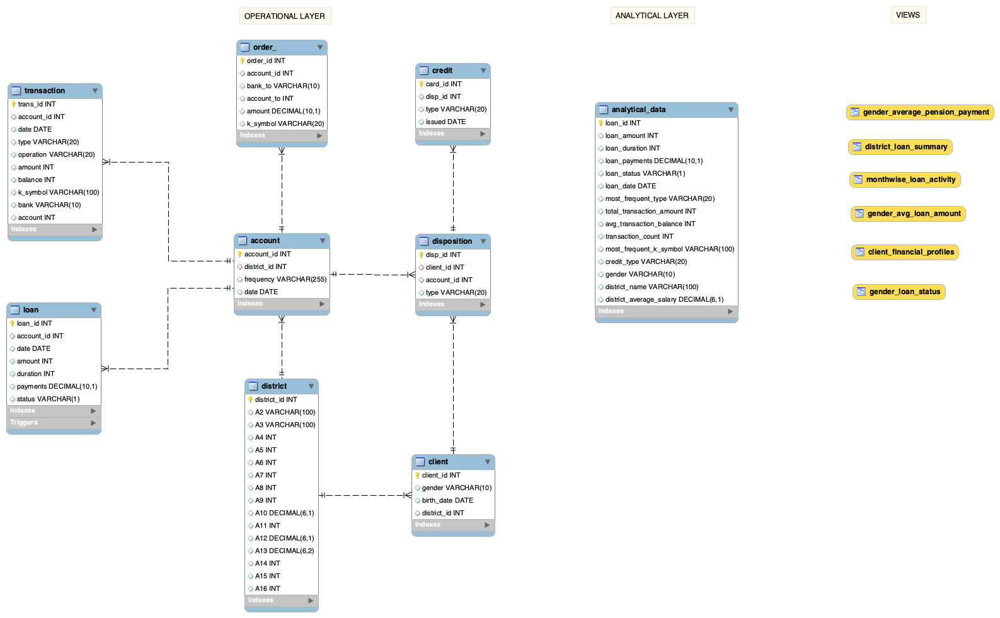
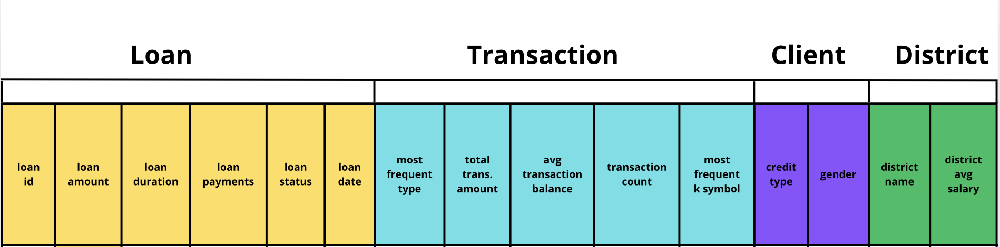

# Term-1
Term Project 1 for Data Engineering 1: SQL and Different Shapes of Data course
# Table of Contents
- [Project Overview](#project-overview)
- [Data Source Details](#data-source-details)
- [Operational Data Layer](#operational-data-layer)
- [Analytics Plan](#analytics-plan)
- [Analytical Data Layer](#analytical-data-layer)
- [ETL Pipeline](#etl-pipeline)
- [Views](#views)
- [Conclusion](#conclusion)
- [Future Work](#future-work)
- [Contact](#contact)

## Usage Instructions
1. Clone the repository: 
```git clone https://github.com/AssetKabdula/Term-1```
## Repository Structure
The repository is organized as follows:
- Term-1/: Main project folder
  - data/: Contains CSV files with raw data
  - SQL outputs: Contains ER diagram and Analytical Table snapshot
  - term_1.sql: The SQL code for the project
  - README.md: Description of the project

## Project Overview
The goal of this project is to analyze loan profiles, gender relationship with status of loans, average loan amount, average duration of loans, seasonal trends in taking loans among customers of Czech Bank. 

The project consists of the following components:

- Operational layer: creating table structures and importing the dataset
- Data analytics plan: analytics to be executed on the data
- Analytical layer: analytical data structure with necessary columns from operational layer
- ETL pipeline: extracting raw data from CSV files, transforming it through cleaning and merging relevant columns, and loading the cleaned data into analytical tables. Triggers and stored procedures are used.
- Data mart: views as data marts

## Data Source Details
The Berka dataset is a collection of financial information from a Czech bank. The dataset deals with over 5,300 bank clients with approximately 1,000,000 transactions. Additionally, the bank represented in the dataset has extended close to 700 loans and issued nearly 900 credit cards, all of which are represented in the data.
- Table Descriptions:
  - `account.csv`: each record describes static characteristics of an account
  - `client.csv`: each record describes characteristics of a client
  - `credit.csv`: Each record describes a credit card issued to an account
  - `disp.csv`: Each record relates together a client with an account i.e. this relation describes the rights of clients to operate accounts
  - `district.csv`: Each record describes demographic characteristics of a district
  - `loan.csv`: Each record describes a loan granted for a given account
  - `order.csv`: Each record describes characteristics of a payment order
  - `trans.csv`: Each record describes one transaction on an account
- Entity-Relationship Description:
  - Each account has both static characteristics (e.g. date of creation, address of the branch) given in relation "account" and dynamic characteristics (e.g. payments debited or credited, balances) given in relations "permanent order" and "transaction".
  - Relation "client" describes characteristics of persons who can manipulate with the accounts.
  - One client can have more accounts, more clients can manipulate with single account; clients and accounts are related together in relation "disposition".
  - Relations "loan" and "credit card" describe some services which the bank offers to its clients.
  - More than one credit card can be issued to an account.
  - At most one loan can be granted for an account.
  - Relation "demographic data" gives some publicly available information about the districts (e.g. average salary); additional information about the clients can be deduced from this.

## Operational Data Layer
- Data Structure - ER Diagram

This includes 8 relational tables, 1 analytical table, 6 views, 2 stored procedures and 1 trigger.

## Analytics Plan
This analysis aims to derive insights from the Berka dataset, with a focus on understanding the financial behavior of clients, the gender characteristics of their loans, and trends in loan repayment.

1. Client Financial Profiles
   
This section explores how various client attributes and their financial behaviors are associated with their loans.

Distribution of loan amounts across client demographics: Understand how loan amounts vary by gender, loan type, and region.
Loan amount categorization: Classify clients into segments (e.g., Top 20% loan amount vs. Below 80% loan amount) based on their loan amounts and financial behavior.
Loan default patterns by region: Identify if there is a regional correlation to loan defaults and examine how different regions contribute to the overall default rate.
Average transaction amounts by loan type: Calculate the average transaction amount per loan type (e.g., personal loans, home loans), and observe trends within each loan type.

2. Loan Status by Demographics
   
This section will analyze the relationship between demographic factors (like gender) and loan status, providing insights into loan performance across different client groups.

Loan status and gender relationship: Explore how loan status (e.g., default, repaid) varies across different genders. Are males or females more likely to default?
Loan amounts by gender: Compare the average loan amounts for male and female clients and assess any gender-based disparities.

3. Loan Duration and Gender

This analysis looks at how the loan duration correlates with gender, exploring whether certain genders take loans for longer or shorter periods on average.

Average loan duration by gender: Assess the average duration of loans for different genders and determine whether one group tends to take longer-term loans than the other.
Loan amount versus loan duration: Investigate whether the loan amount is a significant factor in determining the loan duration for different genders.

4. Monthly Loan Trends

Analyzing loan patterns over time will provide insights into when clients are more likely to take out loans, and whether there are seasonal variations.

Month-wise loan activity: Identify which months experience the highest loan issuance. Are loans concentrated during specific times of the year?
Monthly loan amount trends: Analyze the average loan amount per month to identify if there are seasonal spikes or downturns in loan amounts.

5. Loan Default and Pension Payments by Gender

Understanding how gender relates to loan defaults and pension payments will provide deeper insights into client behavior.

Gender-based pension payments: Analyze pension payments by gender to see if there are any differences in the average pension amounts received.
Loan defaults and gender: Investigate whether there are gender-specific trends in loan defaults and if these clients are taking larger or smaller loans.

6. Loan Amounts and Regional Variations

Regional differences play a significant role in understanding loan behavior, and analyzing these trends will help identify areas with higher loan demand or higher default rates.

Loan amounts across districts: Compare the average loan amount by district to determine which districts issue larger loans.
Loan counts by districts: Analyze how many loans are being issued in each district and which districts contribute most to the overall loan volume.

## Analytical Data Layer 
`analytical_data`

Denormalized Data Structure:
Columns:
- Loan Information:
  - `loan_id`: Primary identifier for each loan
  - `loan_amount`: Amount of the loan
  - `loan_duration`: Duration of the loan in months
  - `loan_payments`: Monthly Payments on Loan
  - `loan_status`: Categorical status of the loan (A' stands for contract finished, no problems; 'B' stands for contract finished, loan not payed;
'C' stands for running contract, OK thus-far; 'D' stands for running contract, client in debt)
  - `loan_date`: Date the loan was issued

- Transaction Information:
  - `most_frequent_type`: Most frequent transaction type (debit/credit).
  - `total_transaction_amount`: Total sum of all transactions 
  - `avg_transaction_balance`: Average balance of transactions
  - `transaction_count`: Total number of transactions
  - `most_frequent_k_symbol`: The most frequent transaction characteristic

- Credit Card Information:
  - `credit_type`: Type of credit associated with the client, such as 'Junior', 'Classic', 'Gold' or 'Not holder'

- Client Information:
  - `gender`: Gender of the client

- District Information:
  - `district_name`: Name of the district where the client resides
  - `district_average_salary`: Average salary of the district's population

 

## ETL Pipeline
- Stored Procedures:
  - The `transform_district` procedure standardizes the format of district names by replacing spaces with underscores
  - The `transform_transaction` procedure standardizes transaction data by converting types to 'Credit' or 'Withdrawal' and replacing transaction codes (k_symbol) with translated descriptions

- Trigger:
  - The `after_loan_insert` trigger is an ETL process that ensures relevant client, transaction, district, and loan data is inserted into the analytical_data table every time a new loan is added to the loan table

## Views
1. Client Financial Profiles View (client_financial_profiles)

This view provides detailed financial profiles of clients, highlighting key characteristics such as loan amount, loan status, and district-specific loan percentiles.

- Fields:
  - `loan_id`: Unique identifier for each loan
  - `gender`: Gender of the client ('M', 'F')
  - `credit_type`: Type of credit the client has
  - `loan_amount`: The total loan amount granted to the client
  - `loan_status`: The current status of the loan 
  - `loan_duration`: The loan duration in months
  - `avg_transaction_by_credit_type`: The average transaction amount for each credit type
  - `loan_percentile_in_district`: The percentile ranking of the loan amount within the client’s district (indicating how the loan compares to others in the same region)
  - `district_default_count`: The count of defaults within the client's district

- Use Case: Client Segmentation: This view enables segmentation of clients into different financial profiles based on their loan amounts, credit types, and statuses, as well as their positioning within their district's loan distribution. This can help identify high-risk clients or those with better credit potential.

2. Gender Relationship with Loan Status View (gender_loan_status)
This view analyzes the relationship between the client's gender and the status of their loans. It aggregates loan data based on gender and loan status, providing insights into how loan outcomes differ between male and female clients.

- Fields:
  - `gender`: Gender of the client ('M', 'F').
  - `loan_status`: Current status of the loan
  - `loan_count`: Total count of loans based on the gender and loan status
  - `avg_loan_amount`: Average loan amount for clients within the specified gender and loan status

- Use Case: Gender-Based Loan Risk Analysis: This view helps in understanding how different genders are represented in various loan statuses. If one gender has higher default rates, targeted intervention can be designed.

3. Gender Relationship with Average Loan Amount and Duration View (gender_avg_loan_amount)
This view examines the relationship between gender and the average loan amount and loan duration. It provides insights into whether men or women typically take larger or longer loans.

- Fields:
  - `gender`: Gender of the client (e.g., 'Male', 'Female').
  - `avg_loan_amount`: Average loan amount for each gender.
  - `avg_loan_duration`: Average loan duration for each gender.

- Use Case: Loan Product Design: By analyzing the average loan amounts and durations by gender, banks can design more relevant loan products that cater to the specific needs of each gender group.

4. Monthwise Loan Activity View (monthwise_loan_activity)
This view provides insights into loan activity trends by month, including the count and average amount of loans taken in each month. It helps understand seasonality or monthly patterns in loan demand.

- Fields:
  - `loan_month`: The month in which the loan was taken
  - `loan_count`: Count of loans taken during the specific month
  - `avg_loan_amount`: Average loan amount for loans taken in that month

- Use Case: Loan Demand Forecasting: This view helps predict periods of high or low loan demand, allowing financial institutions to adjust marketing and outreach efforts accordingly.

5. Gender Relationship with Average Old-Age Pension Payment Amount View (gender_average_pension_payment)
This view examines the relationship between gender and the average old-age pension payment amount. It focuses on the gender-based distribution of pension payments, particularly for clients receiving old-age pensions.

- Fields:
  - `gender`: Gender of the client ('M', 'F')
  - `average_pension_payment`: The average pension payment for clients who have 'Old-age Pension' transactions
  
- Use Case: Pension Policy Insights: This view helps assess gender-based differences in pension payments, which can inform policies on pension distribution or adjustments to ensure fairness.

6. Amount of Loan Relationship with Districts View (district_loan_summary)
This view provides an analysis of the relationship between loan amounts and districts, summarizing the average loan amounts and the total number of loans in each district. It highlights regional trends in loan issuance and amounts.

- Fields:
  - `district_name`: The name of the district
  - `average_loan_amount`: The average loan amount issued within that district
  - `number_of_loans`: The total number of loans issued in that district

- Use Case: Regional Loan Distribution Analysis: This view helps financial institutions analyze how loan amounts vary by district, providing insights into regional financial needs and behaviors.

## Conclusion
This project offers an in-depth analysis of loan repayment patterns, examining how client demographics, including gender and district-specific factors, as well as account behaviors, influence loan statuses. By establishing an effective analytical layer and utilizing stored procedures, triggers, and data marts, the project provides valuable insights into customer loan behaviors. These insights are crucial for identifying clients with high risk and understanding how gender, district location, and individual financial profiles affect loan repayment trends. Such analysis support in recognizing demographic and behavioral patterns that may impact loan outcomes and repayment potential.

## Future work
Building on the insights gained from this project, future analysis could focus on tracking the movement of average monthly balances to identify any behavioral patterns that might indicate a potential default on payments. Additionally, this could help determine whether the bank should consider offering higher-limit cards to certain clients based on their financial behaviors.

## Contact
Please don't hesitate to reach out with any suggestions or ideas for future improvements. Thank you for reviewing this project!

Asset Kabdula- kabdula_asset@student.ceu.edu

Project Link: https://github.com/AssetKabdula/Term-1

